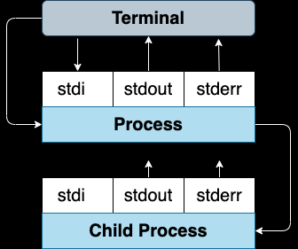
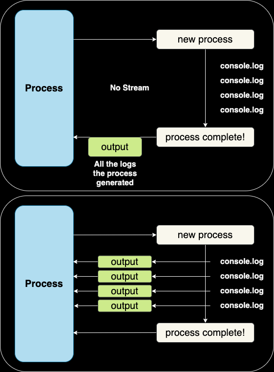

## About The Project

- The Modern Javascript Bootcamp Course (2022)
- The most up-to-date JS resource online! Master Javascript by building a beautiful portfolio of projects!
- Tutorial for watchit
- [Colt Steele](https://github.com/Colt)
- [Stephen Grider](https://github.com/StephenGrider)

&nbsp;

## Notes

### watchit commands

```sh
watchit -h
```

<code>{ stdio: 'inherit' }</code> forwards output infomation to Process from Child Process



|          | Shell? | Stream? |
| :------: | :----: | :-----: |
|   exec   |  yes   |   no    |
| execFile |   no   |   no    |
|  spawn   |   no   |   yes   |
|   fork   |   no   |   yes   |

- Pass options to spawn to behave like exec, execFile or fork.
- [spawn command args-options](https://nodejs.org/dist/latest-v16.x/docs/api/child_process.html#child_processspawncommand-args-options)

&nbsp;

### Terminal & shell

- <code>cat</code> and <code>wc</code> is two different programs.

```sh
cat app.js | wc -l
```



&nbsp;

### Project Setup before writing watchit app.

- Same setup process as nodejs-list.
- In app.js file

```js
#!/usr.bin/env node
```

```sh
chmod +x app.js
npm init -y
```

- In package.json file

```json
"bin": {
    "watchit": "app.js"
  },
```

```sh
npm link
```

&nbsp;

### Big Issues

1. <b>Need to detect when a file changes:</b> Use npm chokidar to detect file changes.
2. <b>It would be nice to provide some help to users of our CLI tool:</b> Use npm caporal to build our CLI tool.
3. <b>Need to figure out how to execute some JS code from within a JS program!:</b> Use standard library module 'child_process' to execute a program.

&nbsp;
