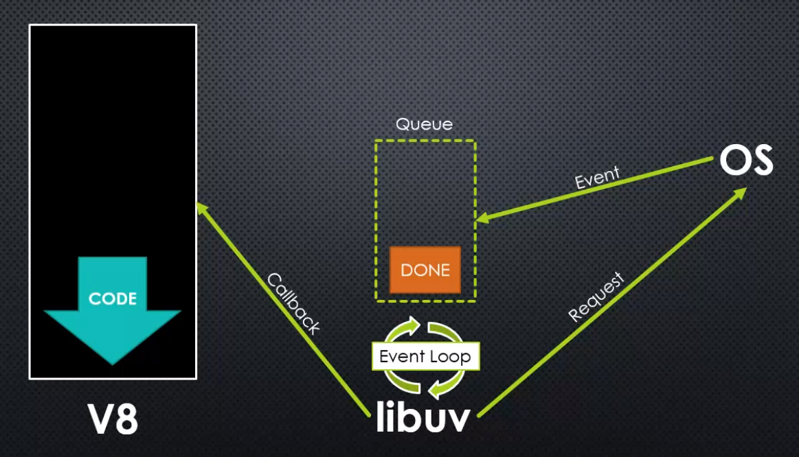
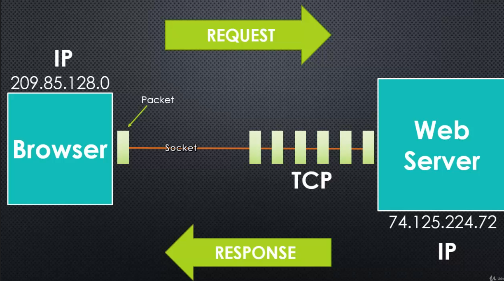

<details>
  <summary>Table of Contents</summary>
  <ol>
    <li><a href="#require">require</a></li>
    <li><a href="#events">Events</a></li>
    <li><a href="#asynchronous-nodejs">Asynchronous (NodeJS)</a></li>
    <li><a href="#http">HTTP</a></li>
  </ol>
</details>

&nbsp;

## About the Project

- Learn and Understand NodeJS
- Dive deep under the hood of NodeJS. Learn V8, Express, the MEAN stack, core Javascript concepts, and more.
- Anthony Alicea

&nbsp;

---

&nbsp;

## require

- <b>require</b> is function, that you pass a 'path' too
- module.exports is what the require function returns
- this works because your code is actually wrapped in a function that is given these things as function parameters
- <b>Revealing Module Pattern: </b>Exposing only the properties and methods you want via an returned object
- [Is there a way to "require" a JS file only once in nodejs?](https://stackoverflow.com/questions/8958097/is-there-a-way-to-require-a-js-file-only-once-in-nodejs)

---

- <b>Web Server Checklist</b>
  - Better ways to organize our code into reusable pieces
  - Ways to deal with files
  - Ways to deal with databases
  - The ability to communicate over the internet
  - The ability to accept requests and send responses (in the standard format)
  - A way to deal with work that takes a long time

&nbsp;

---

&nbsp;

## Events

- Something that has happened in our app that we can respond to
- 2 different kinds of events
  - System Events (C++ Core & libuv)
  - Custom Events (JavaScript Core & Event Emitter)
- <b>Magic String</b>
  - A string that has some special meaning in our code.
  - This is bad because it makes it easy for a typo to cause a bug, and hard for tools to help us find it.

```
Prototype Chain (app.js)

greetr -> Greetr.prototype -> EventEmitter.prototype
                |                 |           |
                 -> greet          -> on       -> emit

greetr.on()
greetr.emit()
greetr.greet()
```

&nbsp;

---

&nbsp;

> Mark: Why not define "greet()" in "Greetr" directly?

> Anthony: For a few reasons, a couple big ones are:
>
> 1. If you define it directly on the object, then a copy of 'greet' will exist on every object you create individually. This takes up memory unnecessarily, especially if you create many Greetr objects. By having all of the objects share the same 'greet' function you save memory space (because 'greet' only exists once).
>
> 2. You can change the 'greet' function and every Greetr object will instantly get access to the change. Not so if every object has its own 'greet' function.
>
> Thanks, and thanks for taking the course!

&nbsp;

---

&nbsp;

## Asynchronous (NodeJS)



- <b>Callbacks</b>
  - A function passed to some other function, which we assume will be invoked at some point
  - The function 'calls back' back invoking the function you give it when it is done doing its work.
  - Ensure the order of callbacks using Promises
  - <b>Error-First Callback: </b>Callbacks take an error object as their first parameter
    - <code>null</code> if no error, otherwise will contain an object defining the error. This is a standard so we know in what order to place our parameters for our callbacks.
- <b>Non-blocking: </b>Doing other things without other things without stopping your programming from running


- <b>Buffer: </b>A temporary holding spot for data being moved from one place to another (intentionally limited in size)
- <b>Stream: </b>A sequence of data made available over time (pieces of data that eventually combine into a whole)
  - <b>Chunk: </b> A piece of data being sent through a stream (data is split in 'chunks' and streamed)
- [TypedArray](https://developer.mozilla.org/en-US/docs/Web/JavaScript/Reference/Global_Objects/TypedArray)
- <b>Abstract (Base) Class: </b>: A type of constructor you never work directly with, but inherit from.
  - We create new custom objects which inherit from the abstract base class.
- <b>Pipe: </b> Connecting two streams by writing to one stream what is being read from another. (in Node you pipe from a Readable stream to a Writable stream)

&nbsp;

---

&nbsp;

## HTTP

- <b>Protocol: </b>A set of rules two sides agree on to use when communicating
  - Both the client and server are programmed to understand and use that particular set of rules. It's similar to two people from different countries agreeing on a language to speak in.



- <b>Port: </b>Once a computer receives a packet, how it knows what program to send it to
  - When a program is setup on the operating system to receive packets from a particular port, it is said that the program is 'listening' to that port


- <b>HTTP: </b>A set of rules and a format for data being transferrred on the web
  - HyperText Transfer Protocol
- <b>MIME type: </b>A standard for specifying the type of data being sent.
  - Multipurpose Internet Mail Extensions (application/json, text/html & image/jpeg)
- <b>Template: </b>Text designed to be the basis for final text or content after being processed.
  - There's usually some specific template language, so the template system knows how to replace placeholders with real values.
- <b>API: </b> A set of tools for building a software application
  - Application Programming Interface. On the web the tools are usually made available via a set of URLs which accept and send only data via HTTP and TCP/IP
- <b>Endpoint: </b> One URL in a web API
  - Sometimes that endpoint (URL) does multiple thing by making choices based on the HTTP request headers
- <b>Serialize: </b>Translating an object into a format that can be stored or transferred
  - JSON, CSV, XML, and others are popular. 'Deserialize' is the opposite (converting the format back into an object).
- <b>Routing: </b>Mapping HTTP requests to content
- <b>REST: </b>An architechtural style for building APIs.
  - Representational State Transfer. We decide that HTTP verbs and URLs mean something

&nbsp;

---

&nbsp;

> <b>NAMAN: </b>Is a REST a standard then?
>
> <b>Anthony: </b>REST is not a standard, it is an architectural style. It is about simplicity, cross-platform compatibility, and cross-programming-language compatibility.
>
> As far as 'state', when you get data from a database you are getting the current 'state' of the database data. When you send data from a form you are sending the 'state' of the form. But the core concept is that each REST communication contains all of the 'state' needed to act (i.e. the verb, the data, the other headers).

&nbsp;

---

&nbsp;
